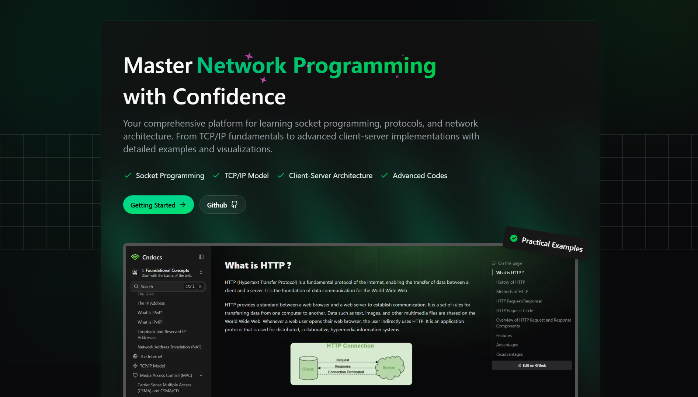

# CN Docs - The Ultimate Networking Documentation



## Comprehensive Computer Networking & Socket Programming Documentation

A beautiful, structured learning resource for students and professionals

[View Live Site](https://cn.mvp-subha.me)

## 📚 Overview

CN Docs is a comprehensive, well-structured documentation site for computer networking and socket programming. Built with Next.js and Fumadocs, it provides clear explanations, practical examples, and high-quality code samples for everything from networking fundamentals to advanced socket programming techniques.

## ✨ Features

### Website Features

- 📚 **Comprehensive documentation** with MDX support
- 🔍 **Full-text search functionality**
- 🖼️ **Dynamic OG image generation** for social sharing
- 📱 **Fully responsive design** for all devices
- 🎨 **Clean and modern UI** powered by Fumadocs
- ⚡ **Fast and SEO-friendly** with Next.js
- 📝 **Easy-to-follow structured learning path**

### Content Features

- 🧠 **Comprehensive coverage** from OSI model to advanced socket programming
- 💻 **High-quality code examples** with proper documentation
- 🛠️ **Practical projects** with real-world networking applications
- 📊 **Visual explanations** with diagrams and illustrations
- 🔄 **Interactive examples** where applicable
- 📘 **Beginner-friendly explanations** of complex concepts

### Technical Features

- 🚀 **Next.js framework** for optimal performance
- 📄 **MDX documentation** for rich content
- 🎨 **Tailwind CSS** for beautiful styling
- 🔧 **TypeScript** for type safety
- 🔄 **Automated content generation** tools
- 🌐 **SEO optimization** for better discoverability

## 🧩 Content Structure

The documentation is organized into logical sections:

### I. Foundational Concepts

- Networking Basics
- OSI Model
- TCP/IP Model
- Network Topologies
- IP Addressing & DNS
- Internet Architecture
- TCP & UDP Protocols
- MAC Addressing
- URL Structure
- HTTP Protocol

### II. Socket Programming

- Socket Fundamentals
  - Socket Types
  - Socket API
  - Socket Options
  - Byte Order
  - Security Considerations
  - Best Practices
- Socket Models
  - TCP Sockets
  - UDP Sockets
  - Client-Server Architecture
  - Multicast Communication
  - Unix Domain Sockets
  - Raw Sockets
- Advanced Techniques
  - Blocking vs Non-blocking
  - Multiplexing (select/poll)
  - Advanced Multiplexing (epoll)
  - Socket I/O Techniques
  - Debugging Socket Applications
- Error Handling

### III. Code in Action

- Complete networking projects
- Example implementations
- Performance benchmarks

## 💻 Code Examples

Each topic includes practical, well-commented code examples that demonstrate key concepts. Our examples:

- Follow best practices for production-ready code
- Include comprehensive error handling
- Provide clear comments explaining each step
- Are tested in real-world scenarios
- Include both basic and advanced implementations

Example from our Client-Server Architecture section:

```c
// Message header structure
struct message_header {
    uint8_t  version;       // Protocol version
    uint8_t  type;          // Message type
    uint16_t command;       // Command identifier
    uint32_t payload_size;  // Size of the payload
    uint32_t sequence_id;   // Message sequence number
};

// Complete message structure
struct message {
    struct message_header header;
    char payload[MAX_PAYLOAD_SIZE];
};
```

## 🚀 Getting Started

### Prerequisites

- Node.js 18.0 or higher
- Bun (recommended) or npm/yarn

### Installation

1. Clone the repository:

   ```bash
   git clone https://github.com/subhadeeproy3902/cn-docs.git
   cd cn-docs
   ```

2. Install dependencies:

   ```bash
   bun install
   # or
   npm install
   ```

3. Run the development server:

   ```bash
   bun run dev
   # or
   npm run dev
   ```

4. Open [http://localhost:3000](http://localhost:3000) in your browser.

## 🛠️ Built With

- [Next.js](https://nextjs.org/) - React framework
- [Fumadocs](https://fumadocs.vercel.app/) - Documentation framework
- [Tailwind CSS](https://tailwindcss.com/) - Utility-first CSS framework
- [TypeScript](https://www.typescriptlang.org/) - Type-safe JavaScript
- [MDX](https://mdxjs.com/) - Markdown with JSX

## 📝 Content Creation

### Adding New Documentation

We use a custom script to easily add content from sources like GeeksforGeeks:

```bash
bun run add-doc <url>
```

This automatically:

- Scrapes content from the provided URL
- Downloads images to the public folder
- Generates well-formatted MDX files
- Applies proper formatting and styling

### Manual Content Creation

1. Create a new MDX file in the appropriate directory under `content/docs/`
2. Add frontmatter with title and description
3. Write your content using Markdown and MDX components
4. Add code examples, images, and other resources as needed

## 🤝 Contributing

Contributions are welcome! Please feel free to submit a Pull Request.

1. Fork the repository
2. Create your feature branch (`git checkout -b feature/amazing-feature`)
3. Commit your changes (`git commit -m 'Add some amazing feature'`)
4. Push to the branch (`git push origin feature/amazing-feature`)
5. Open a Pull Request

## 📄 License

This project is licensed under the MIT License - see the LICENSE file for details.

## 🙏 Acknowledgements

- [GeeksforGeeks](https://www.geeksforgeeks.org/) for some of the reference content
- All contributors who have helped improve this documentation
- The open-source community for the amazing tools that made this possible

---

Created with ❤️ by [Subhadeep Roy](https://github.com/subhadeeproy3902)

Visit the live site: [https://cn.mvp-subha.me](https://cn.mvp-subha.me)
